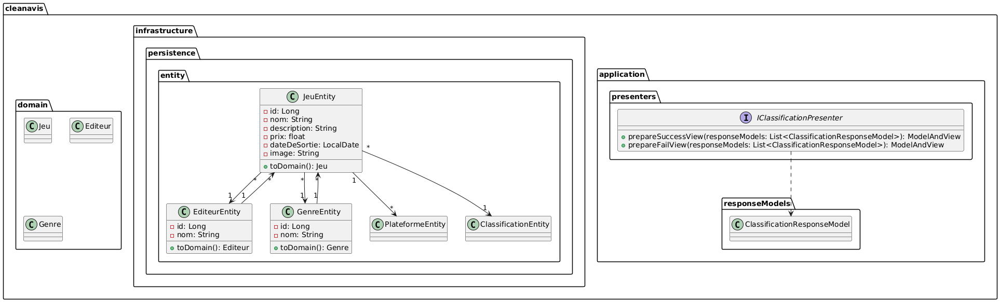

# Avis en Clean Architecture

## Introduction

Ce document présente l'architecture logicielle de l'application "Avis" en suivant les principes de la Clean Architecture, tels qu'ils sont décrits par Oncle Bob. L'objectif est de structurer l'application de manière modulaire, en séparant clairement les préoccupations métier des détails d'implémentation (framework, base de données, etc.).

## Principes de la Clean Architecture

La Clean Architecture, proposée par Robert C. Martin (Uncle Bob), repose sur plusieurs principes :

- **Indépendance du framework** : L'application ne doit pas être dépendante d'un framework spécifique.
- **Indépendance de la base de données** : Les données peuvent être stockées dans n'importe quel système de persistance.
- **Indépendance de l'interface utilisateur** : L'application doit fonctionner avec n'importe quelle interface utilisateur.
- **Testabilité** : Les règles métier doivent être testables indépendamment des autres composants.

## Couches de l'Architecture

L'application est organisée en plusieurs couches :

### **Entities (Domaine Métier)**

- Représente les objets du domaine (ex. `Avis`, `Jeu`, `Utilisateur`).
- Contient la logique métier pure.
- Indépendante de toute technologie externe.

### **Use Cases ou Interactors (Application Layer)**

- Contient les interactors spécifiques de l'application.
- Implémente les règles métier en interaction avec les entités.
- Définit des interfaces pour les services externes.

### **Adapters (Interface Layer)**

- Contient les implémentations des interfaces définies dans la couche Application.
- Regroupe les services d'accès à la base de données (Repositories), de communication (API REST), et d'authentification.
- Implémente les contrôleurs de l'API REST.

### **Infrastructure (Frameworks & Drivers Layer)**

- Contient les détails techniques comme la configuration de la base de données (ex. PostgreSQL, MongoDB), les frameworks web (Spring Boot, Express.js, etc.).
- Ne doit pas impacter les autres couches.

### UML

- **Diagramme des paquetages**

## Conclusion

L'architecture proposée permet une séparation claire des responsabilités, facilitant la maintenabilité et l'évolutivité de l'application. L'approche Clean Architecture garantit un code structuré et testable, conforme aux bonnes pratiques du développement logiciel.

